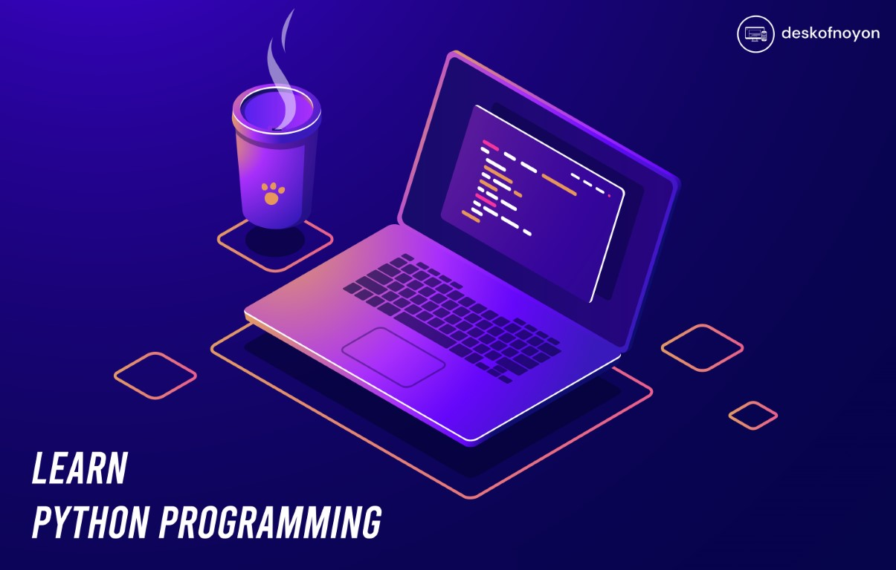

| Python Programming                                       |   
|----------------------------------------------------------| 
| 1. [Day - 01 ](./Day_1/learning_outcomes.md#day---01)    | 
| 2. [Day - 02 ](./Day_2/learning_outcomes.md#day---02)    |
| 3. [Day - 03 ](./Day_3/learning_outcomes.md#day---03)    |  
| 4. [Day - 04 ](./Day_4/learning_outcomes.md#day---04)    |   
| 5. [Day - 05 ](./Day_5/learning_outcomes.md#day---05)    |
| 6. [Day - 06 ](./Day-6/learning_outcomes.md#day---06)    |
 

## Reserved keywords in Python

|    1   	|     2    	|   3   	|    4   	|    5    	|    6   	|
|:------:	|:--------:	|:-----:	|:------:	|:-------:	|:------:	|
|  True  	|   False  	|  None 	|  class 	| finally 	|   is   	|
| return 	| continue 	|  for  	| lambda 	|   try   	|   def  	|
|  from  	| nonlocal 	| while 	|   and  	|   del   	| global 	|
|   not  	|   with   	|   as  	|  elif  	|    if   	|   or   	|
|  yield 	|  assert  	|  else 	| import 	|   pass  	|  break 	|
| except 	|    in    	| raise 	|        	|         	|        	|